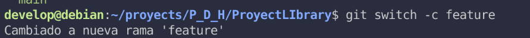

# Sistema de Gestión de Biblioteca

## Descripción del Proyecto

> Este proyecto es una aplicación web diseñada para la gestión integral de una biblioteca. Permite a los usuarios buscar, visualizar y tomar prestados libros, mientras que los administradores tienen control total sobre el catálogo de libros y los usuarios. El objetivo es digitalizar y optimizar los procesos de una biblioteca tradicional, haciendo la gestión de recursos más eficiente y accesible.

## Requisitos Técnicos

Para ejecutar este proyecto de manera local, asegúrate de tener instaladas las siguientes herramientas y versiones:

- **Node.js**: v14 o superior
- **npm**: v6 o superior (o Yarn si prefieres)
- **MySQL**: v5.7 o superior
- **Java**: v11 o superior
- **Spring Boot**: v2.5.x o superior
- **Git**: v2.x o superior

Es recomendable tener un entorno de desarrollo con soporte para Java y Node.js, además de tener configurado un servidor MySQL local para la base de datos.

## Tecnologías Utilizadas

Las siguientes tecnologías han sido seleccionadas para el desarrollo del proyecto:

- **Frontend**: React, Next.Js,Git, GitHub
- **Backend**: Spring Boot, Spring Security
- **Base de Datos**: MySQL
- **Gestión de Paquetes**: npm, Yarn, Bun
- **Estilos**: Tailwind CSS

## Instalación

Sigue los pasos a continuación para tener una copia local del proyecto funcionando.

### 1. Clona el repositorio

Primero, clona el repositorio del proyecto en tu máquina local:

```bash
git clone https://github.com/soporCiber11M/ProyectLibrary.git
cd ProyectLIbrary
```

Instala las dependencias del frontend

Accede al directorio del frontend e instala las dependencias necesarias:

```bash
cd frontend # o la carpeta correspondiente
npm install   # o yarn install
```

nstala las dependencias del backend

Accede al directorio del backend e instala las dependencias necesarias:

```bash
cd backend  # o la carpeta correspondiente
npm install   # o yarn install
```


Ejecuta la aplicación

Inicia los servidores del frontend y backend en terminales separadas:

_Backend:_

```bash
cd backend
npm start  # o npm run dev
```

_Frontend:_

```bash
cd frontend
npm start  # o npm run dev

```

---

## Roles de Usuario

> El sistema cuenta con dos roles principales para gestionar diferentes niveles de acceso y permisos:

### Administrador

**_Gestión completa del catálogo de libros (añadir, editar, eliminar)._**

**_Gestión de usuarios y sus roles._**

**_Visualización de informes y estadísticas de préstamos._**

### Usuario

**_Búsqueda de libros en el catálogo._**

**_Visualización de detalles de los libros._**

**_Funcionalidad para tomar prestados y devolver libros._**

**_Visualización de su historial de préstamos._**

### Flujo de Trabajo con Git

**_Este proyecto utiliza un flujo de trabajo de ramificación basado en Git Flow, con las siguientes ramas principales:_**

**_main:_** Contiene el código listo para ser desplegado en producción.

**_develop:_** Rama principal de desarrollo, donde se integran las nuevas funcionalidades.

**_feature/:_** Ramas específicas para el desarrollo de nuevas funcionalidades o correcciones de errores.

### Pasos a seguir para el desarrollo

**_Actualiza tu rama local develop:_**


## Trabajo Colaborativo

### 👑 Líder del Proyecto: Darwin Joel

Como líder del proyecto, mi rol ha abarcado la configuración inicial del repositorio, la gestión de la estructura de ramas y la implementación de políticas de protección para asegurar la integridad del código.

#### 1. Creación del Repositorio

El primer paso fue inicializar nuestro repositorio en GitHub para centralizar nuestro código.
Aquí puedes ver la interfaz de creación del repositorio:
`

#### 2. Configuración de Ramas

Establecí una estructura de ramas clara para facilitar el desarrollo en paralelo y la integración de características. Las ramas principales incluyen main (producción), feature (funciones), fix (errores), release (produccion) y ramas de características individuales.
Aquí se muestra la estructura de ramas inicial:





#### 3. Protección de Ramas

Para garantizar la estabilidad de nuestras ramas main, feature, fix y release, implementé reglas de protección que requieren revisiones de código y pases de CI/CD antes de fusionar.
Captura de pantalla de las reglas de protección de rama:
`

#### 4. Gestión del Flujo de Trabajo

He supervisado los pull requests, la resolución de conflictos y he garantizado que nuestro proceso de integración continua se mantenga fluido.

### 👨‍💻 Colaborador 1: Chistofer

Chistofer se ha encargado de crear las entidades y asi mismo generar la base de datos que usaremos a lo largo de la creacion de nuestro aplicativo.

Evidencia de Contribución:

    
    `

👩‍💻 Colaborador 2: Anthony

Anthony ha trabajado en [describe sus tareas y responsabilidades].

Evidencia de Contribución:

   
    `

🧑‍💻 Colaborador 3: Mariano

Mariano ha contribuido con [describe sus tareas y responsabilidades].

Evidencia de Contribución:

    
    `

⚙️ Características

    [Lista de características principales de la biblioteca online, por ejemplo:]

        Búsqueda y filtrado de libros.

        Gestión de perfiles de usuario.

        Sistema de préstamos y devoluciones.

        Panel de administración.

