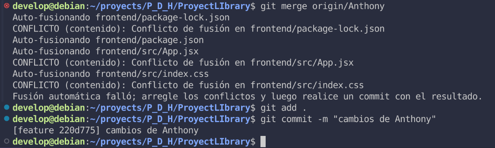
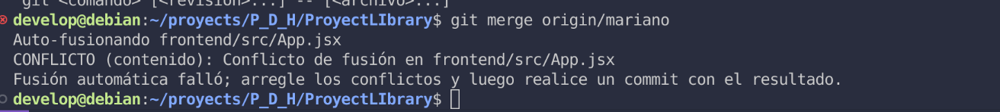
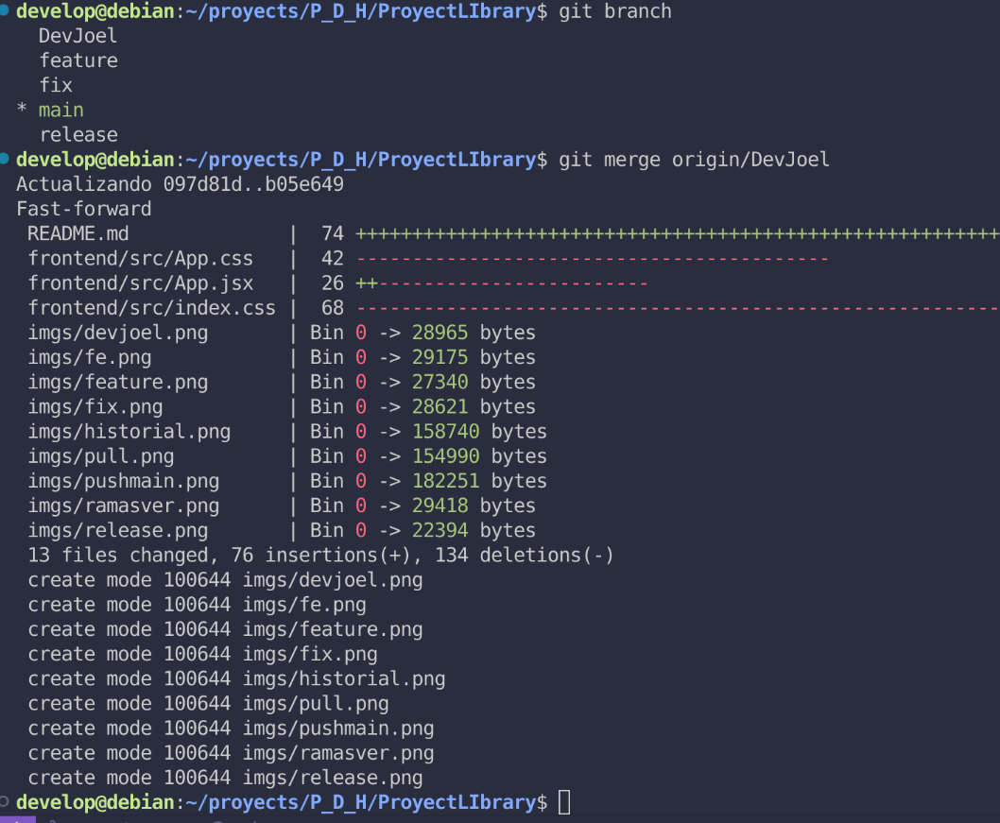
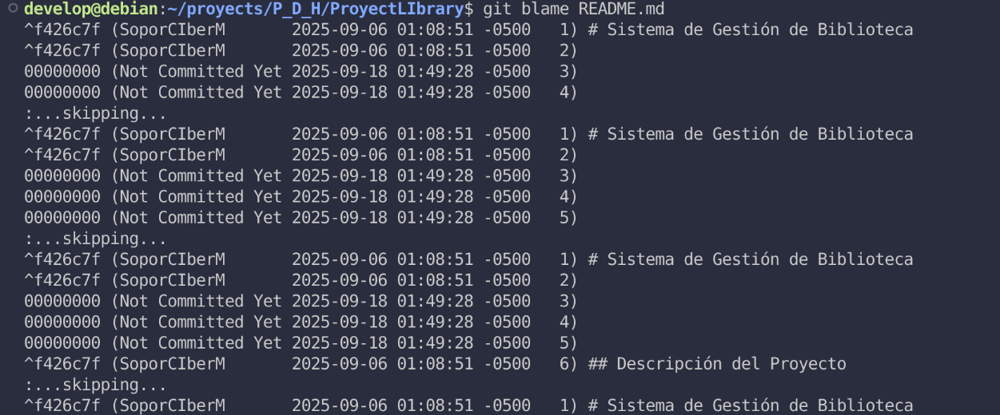

# Sistema de Gestión de Biblioteca


## Descripción del Proyecto

> Este proyecto es una aplicación web diseñada para la gestión integral de una biblioteca. Permite a los usuarios buscar, visualizar y tomar prestados libros, mientras que los administradores tienen control total sobre el catálogo de libros y los usuarios. El objetivo es digitalizar y optimizar los procesos de una biblioteca tradicional, haciendo la gestión de recursos más eficiente y accesible.


### Es una plataforma donde los usuarios pueden:

 . Buscar libros por título, autor o categoría.

  . Ver detalles de los libros.

 . Registrarse, iniciar sesión y gestionar su propia biblioteca.

 . Solicitar préstamos virtuales o descargar PDFs si aplica.

 ### 🎯 Objetivos

#### Objetivo General:

>Desarrollar una aplicación web funcional de biblioteca online que permita a los usuarios interactuar con una colección digital de libros.

Objetivos Específicos:

- Implementar una interfaz amigable y accesible.

- Gestionar usuarios mediante autenticación segura.

- Crear una base de datos estructurada para libros y usuarios.

- Validar el correcto funcionamiento con pruebas y retroalimentación.

### 🌟 Características Principales

- 🔍 Búsqueda avanzada de libros

- 📝 Registro e inicio de sesión

- 📂 Visualización y gestión de libros

- 🛡️ Sistema de autenticación

- 📈 Panel administrativo (opcional)

### 👥 Roles del Equipo

| Nombre del Colaborador | Rol en el Proyecto                         | Tareas Asignadas                                                                 |
|------------------------|--------------------------------------------|----------------------------------------------------------------------------------|
| Darwin            | Líder de Proyecto / Full Stack    | Organización general, diseño de interfaz, desarrollo de páginas principales     |
| Chistofer             | Backend Developer                          | Gestión de base de datos, APIs, autenticación de usuarios                       |
| Anthony             | Diseñador UX/UI y Frontend                         | Diseño visual de la app, experiencia de usuario, creación de wireframes         |
| Mariano             | Tester / Frontend                     | Pruebas funcionales, control de calidad, redacción de documentación del sistema |


### 🧪 Uso de Git y GitHub

Durante el desarrollo del proyecto, aplicamos buenas prácticas de control de versiones:

- Uso de ramas (`feature`, `fix`, `release`)
- Commits descriptivos siguiendo convenciones
- Pull requests para revisión de código entre el equipo
- Issues para registrar tareas y errores

### 📦 Estructura del Proyecto

ProyectLibrary/
│
├── backend/                # Proyecto Spring Boot
│   ├── src/main/java/
│   └── src/main/resources/
│
├── frontend/               # Proyecto React
│   ├── public/
│   └── src/
│
├── README.md
├── LICENSE

---


## Requisitos Técnicos

Para ejecutar este proyecto de manera local, asegúrate de tener instaladas las siguientes herramientas y versiones:

- **Node.js**: v18 o superior
- **npm**: v6 o superior (o Yarn si prefieres)
- **MySQL**: v5.7 o superior
- **Java**: v17 o superior
- **Spring Boot**: v2.5.x o superior
- **Git**: v2.x o superior

Es recomendable tener un entorno de desarrollo con soporte para Java y Node.js, además de tener configurado un servidor MySQL local para la base de datos.

### 🧰 Tecnologías Utilizadas
#### ⚙️ Backend (API REST):

Java 17

Spring Boot

Spring Data JPA

Spring Security (opcional)

MySQL / PostgreSQL (según el motor de BD que usen)

#### 🎨 Frontend:

React.js

HTML5 + CSS3

React Router

Axios

#### 🛠️ Herramientas:

Git y GitHub

Visual Studio Code / IntelliJ

Postman (para pruebas API)

Figma / Canva (para diseño UI)


### ✅ Requisitos del Proyecto
#### 🔹 Requisitos Funcionales

Los requisitos funcionales definen qué hace el sistema. Son acciones que el usuario puede realizar o funcionalidades que el sistema debe ofrecer.


| ID   | Requisito Funcional                | Descripción                                                                     |
| ---- | ---------------------------------- | ------------------------------------------------------------------------------- |
| RF01 | Registro de usuarios               | El sistema debe permitir a los usuarios registrarse con correo y contraseña.    |
| RF02 | Inicio de sesión                   | Los usuarios podrán iniciar sesión en la plataforma con sus credenciales.       |
| RF03 | Búsqueda de libros                 | Los usuarios podrán buscar libros por título, autor o categoría.                |
| RF04 | Visualización de libros            | Se mostrará información detallada del libro (título, autor, descripción, etc.). |
| RF05 | Gestión de biblioteca personal     | Cada usuario podrá guardar libros en su lista personal de lectura.              |
| RF06 | Panel de administración (opcional) | El administrador podrá añadir, editar o eliminar libros del catálogo.           |

#### 🔸 Requisitos No Funcionales

Los requisitos no funcionales definen cómo debe comportarse el sistema. No son acciones directas del usuario, pero afectan la calidad del software.
| ID    | Requisito No Funcional | Descripción                                                                      |
| ----- | ---------------------- | -------------------------------------------------------------------------------- |
| RNF01 | Seguridad              | Las contraseñas deben estar cifradas y los datos protegidos.                     |
| RNF02 | Rendimiento            | El sistema debe responder a las acciones del usuario en menos de 2 segundos.     |
| RNF03 | Escalabilidad          | La app debe poder manejar un creciente número de usuarios y libros.              |
| RNF04 | Usabilidad             | La interfaz debe ser intuitiva, clara y accesible para todos los usuarios.       |
| RNF05 | Mantenibilidad         | El código debe estar organizado para facilitar futuras mejoras o correcciones.   |
| RNF06 | Disponibilidad         | El sistema debe estar disponible el 95% del tiempo, salvo durante mantenimiento. |


## Instalación

Sigue los pasos a continuación para tener una copia local del proyecto funcionando.

### 1. Clona el repositorio

Primero, clona el repositorio del proyecto en tu máquina local:

```bash
git clone https://github.com/soporCiber11M/ProyectLibrary.git
cd ProyectLIbrary
```

Instala las dependencias del frontend

Accede al directorio del frontend e instala las dependencias necesarias:

```bash
cd frontend # o la carpeta correspondiente
npm install   # o yarn install
```

nstala las dependencias del backend

Accede al directorio del backend e instala las dependencias necesarias:

```bash
cd backend  # o la carpeta correspondiente
npm install   # o yarn install
```

Ejecuta la aplicación

Inicia los servidores del frontend y backend en terminales separadas:

_Backend:_

```bash
cd backend
./mvnw spring-boot:run
```

_Frontend:_

```bash
cd frontend
npm start  # o npm run dev

```

---

## Roles de Usuario

> El sistema cuenta con dos roles principales para gestionar diferentes niveles de acceso y permisos:

### Administrador

**_Gestión completa del catálogo de libros (añadir, editar, eliminar)._**

**_Gestión de usuarios y sus roles._**

**_Visualización de informes y estadísticas de préstamos._**

### Usuario

**_Búsqueda de libros en el catálogo._**

**_Visualización de detalles de los libros._**

**_Funcionalidad para tomar prestados y devolver libros._**

**_Visualización de su historial de préstamos._**


### Flujo de Trabajo con Git

**_Este proyecto utiliza un flujo de trabajo de ramificación basado en Git Flow, con las siguientes ramas principales:_**

| Rama                   | Propósito                                                                                                                                                                            |
| ---------------------- | ------------------------------------------------------------------------------------------------------------------------------------------------------------------------------------ |
| **`main`**             | Contiene el código estable y listo para producción. Todo lo que se fusiona aquí debe estar completamente probado.                                                                    |
| **`release`**          | Rama principal de desarrollo. Aquí se integran las funcionalidades completas desde las ramas `feature/` antes de pasar a producción.                                                 |
| **`feature/`** | Ramas creadas para desarrollar nuevas funcionalidades. Se crean a partir de `release` y, al completarse, se fusionan nuevamente en `release`. <br>*Ejemplo: `feature/login-usuario`* |
| **`fix/`**     | Ramas utilizadas para solucionar errores o bugs. También parten de `release` y se fusionan de regreso una vez solucionado el problema. <br>*Ejemplo: `fix/busqueda-error`*           |


### Pasos a seguir para el desarrollo


## Trabajo Colaborativo

### 👑 Líder del Proyecto: Darwin Joel

Como líder del proyecto, mi rol ha abarcado la configuración inicial del repositorio, la gestión de la estructura de ramas y la implementación de políticas de protección para asegurar la integridad del código.

#### 1. Creación del Repositorio

El primer paso fue inicializar nuestro repositorio en GitHub para centralizar nuestro código.
Aquí puedes ver la interfaz de creación del repositorio:
`

#### 2. Configuración de Ramas

Establecí una estructura de ramas clara para facilitar el desarrollo en paralelo y la integración de características. Las ramas principales incluyen main (producción), feature (funciones), fix (errores), release (produccion) y ramas de características individuales.
Aquí se muestra la estructura de ramas inicial:


#### 3. Conflictos

A lo largo del hacer merge de las ramas de mis colaboradores se presentaron algunos conflictos
ya que algunos de ellos habian modificado en el mismo archivo.




### 4. Merge




## 5. Blame




#### 4. Gestión del Flujo de Trabajo

He supervisado los pull requests, la resolución de conflictos y he garantizado que nuestro proceso de integración continua se mantenga fluido.

### 👨‍💻 Colaborador 1: Chistofer

Chistofer se ha encargado de crear las entidades y asi mismo generar la base de datos que usaremos a lo largo de la creacion de nuestro aplicativo.

Evidencia de Contribución:

    `

👩‍💻 Colaborador 2: Anthony

Anthony ha trabajado en [describe sus tareas y responsabilidades].

Evidencia de Contribución:

    `

🧑‍💻 Colaborador 3: Mariano

Mariano ha contribuido con [describe sus tareas y responsabilidades].

Evidencia de Contribución:

    `

⚙️ Características

    Lista de características principales de la biblioteca online:

        Búsqueda y filtrado de libros.

        Gestión de perfiles de usuario.

        Sistema de préstamos y devoluciones.

        Panel de administración.


| Funcionalidad                | Estado           |
| ---------------------------- | ---------------- |
| Login/Registro de usuario    | ✅ Completado     |
| Listado de libros            | 🔄 Completado     |
| Búsqueda por categoría/autor | 🔄 En desarrollo |
| Panel de administración      | ⏳ Pendiente      |
| Pruebas con Postman          |  ✅ Completado     |
| Creacion de Entidades       |  ✅ Completado     |


### 📌 Conclusiones

En este proyecto aprendimos a trabajar en equipo usando control de versiones, a integrar frontend y backend, y a construir una solución digital útil. El trabajo colaborativo y la división de roles fue clave para cumplir los objetivos.

